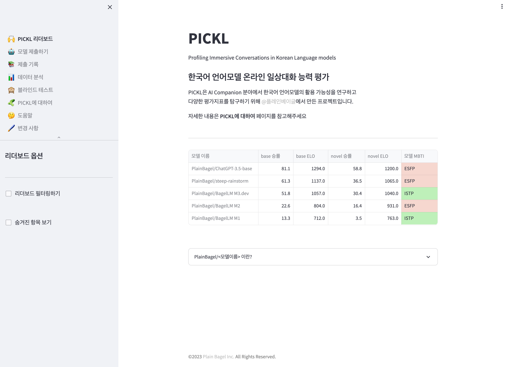

# PICKL: Profiling Immersive Conversations in Korean Language models
[](https://github.com/tatsu-lab/stanford_alpaca/blob/main/LICENSE) 
[](https://www.python.org/downloads/release/python-311/)

한국어 언어 모델 온라인 일상 대화 능력 평가 리더보드입니다.

- 리더보드 : https://pickl.pbagel.com/
- 문의사항 : pickl@pbagel.com  

&nbsp; 

[**PICKL에 대하여**](#-pickl에-대하여)
| [**Structure**](#structure)
| [**Process**](#-process)
| [**리더보드 참여 방법**](#리더보드-참여-방법)
| [**Reference**](#reference)

  

&nbsp;

## 🥒 PICKL에 대하여
PICKL은 한국어 언어 모델들의 일상 대화 능력을 비교하고, 각 모델들이 일상 대화에서 보이는 성격을 프로파일링 하는 것을 목표로 두고 있습니다.

일상 대화 언어 모델 리더보드의 필요성은 다음과 같습니다:

- 언어 모델 평가는 근본적으로 주관적인 것이기 때문에, 다양한 관점에서의 평가가 필요합니다. 참신한 평가 방법들을 활용하여 다각도로 모델을 평가하고자 합니다.
- 한국어 일상 대화에 초점을 두고 개인 및 기업에서 공개/비공개된 모델, 혹은 프롬프트만 가지고 쉽게 참여 할 수 있습니다.
- 단순히 순위를 매기는 것보다는, 개성과 성향이 서로 다른 사람들처럼 각 모델의 성격과 특성을 프로파일링하고자 합니다.


> 모델 제출과 피드백을 통해 PICKL에 적극적인 참여를 부탁드리며, 친구 같은 AI를 만들어 나가는 여정에 함께해 주시기 바랍니다.  

&nbsp; 

## Structure
|         **Directory**/Root File          | Description                                                                                          |
|:----------------------------------------:|------------------------------------------------------------------------------------------------------|
| **[conv_generate](pickl/conv_generate)** | User(A)와 GPT-4(B) 사이의 대화를 생성합니다. <br/> `primer_gen.py` : 대화 생성에 사용되는 primer들을 생성합니다.                      |
|  **[model](pickl/conv_generate/model)**  | `user.py` : 사용자가 입력으로 주어야 할 endpoint가 동작하는 과정입니다.  <br/> `bot.py` : GPT-4가 동작하는 과정입니다. |
|    **[evaluation](pickl/evaluation)**    | 생성된 대화를 기반으로 GPT-4가 evaluation prompt를 이용하여 평가합니다.                                                   |
|        **[rating](pickl/rating)**        | 두 가지의 대화를 비교하는 prompt의 경우, elo rating을 사용합니다.                                                        |
|     **[resources](pickl/resources)**     | `prompt` : 대화 생성, evaluation 등에 쓰이는 prompt가 있습니다. <br/> `topic_primer` : 주제, 대화 예제가 존재합니다. |
|  [api_example.py](pickl/api_example.py)  | 사용자가 리더보드에 모델을 올리기 위한 API를 만드는 예제입니다.<br/>(GPT-3.5가 일상대화를 할 수 있게끔 prompt engineering한 model endpoint)                                                                | 

&nbsp; 

## ✔️ Process

### 1. 주제 선정
- AI HUB SNS 데이터 고도화 & 한국어 멀티세션 대화에 존재하는 주제 분포를 기준으로 선정 (30개)
- AI HUB 한국어 대화 요약에서 선정된 대화에 대한 주제 (9개)
    - 주제 앞에 (HUB) 표시 있음  


&nbsp; 

### 2. 대화의 첫 문장 생성
- GPT-4에 prompt를 입력하여 대화의 첫 문장 생성 (각 주제별 7개씩 총 210개)
- AI HUB 한국어 대화 요약의 valid/test dataset 중 일부를 random으로 선정 (총 210개)  

|prompt로 생성된 대화의 첫 문장|AI HUB에서 random으로 선택한 첫 문장|
|---|---|
|요즘 날씨 미친것 같음 ㅋㅋㅋㅋ 아 나만 그래?|아 글고 물 사야돼 왤ㄹ케 빨리 먹는겨|
|집 조명 정리하려는데 좋은 제품 있으면 추천 좀.|헐키 ㅋㅋㅋㅋ 백화점이나 아울렛에잇어야지대|
|첫사랑 이야기 들려줘. 재미있겠다 ㅎㅎ|야 낼 보는고 맞징?|  

&nbsp; 

### 3. 대화 생성
- 총 5 turn의 대화로 구성됨
    - Bot(A) : GPT-4
    - User(B) : 제출한 AI model  
  
&nbsp; 

- 대화 구조 예시 (GPT-4와 PlainBagel/BagelLM M3.dev 사이의 5 turn 대화)
```
A: 오랜만에 레트로 게임 어때? '슈퍼 마리오' 같은 게임 오랜만에 해보자고?ㅋㅋㅋ
B: 슈퍼마리오? 옛날 게임이야?
A: ㅇㅇ, 그런데 그게 완전 흥미로워! 재밌을 거야, 연습해봐!ㅋㅋ
B: 오오, 좋아! ㅋㅋㅋㅋ 일단 너가 우리 집에 와서 해줘!
A: 정말?ㅋㅋ 그럼 내일 뭐할 일 없으면 너네 집 갈게. 마리오카트도 같이 해봐야지!
B: 오 좋았어, 그럼 내일 저녁 6시나 7시에 보자고! 재밌게 해보자!
A: 그럼, 내일 저녁에 보자. 뭐 좀 싸가지고 갈게, 고기나 사올까?ㅎㅎㅎ
B: ㅋㅋㅋㅋ오 그랭! 그럼 고기랑 2차 게임들 좀 준비해줘!
A: 콜! 고기 싸고, 게임도 준비해놓을게! 내일 만나서 즐거운 시간되자!ㅎㅎㅎ
B: 얍얍!
```
&nbsp; 


### 4-1. GPT-4를 활용한 자동 평가
- **base prompt**
  -  랜덤한 2개의 User model(B)의 대화를 base prompt 기준으로 비교하여 평가합니다.
  -  모두 평가한 이후, elo rating을 통해 순위를 매깁니다.

- **novel prompt**
  - User model(B)의 대화를 novel prompt 기준으로 평가합니다.
  - 모두 평가한 이후, elo rating을 통해 순위를 매깁니다.

- **mbti prompt**
  - User model(B)의 대화를 묶어 mbti prompt 기준으로 한 번에 평가합니다.
  - 대화 묶음들을 평가 한 후, 전체 결과를 종합하여 최종 MBTI를 보여줍니다. 만약 각 성격 항목에서 동점이 나온 경우, 비교 테스트에서 승리 횟수가 더 많은 성격 유형을 채택합니다.  

&nbsp; 

### 4-2. 블라인드 테스트를 통한 수동 평가
Coming Soon!

&nbsp; 

## 리더보드 참여 방법
1. [API 생성 예제](pickl/api_example.py) 및 [설명](pickl/README.md)을 참고하여 User model API를 생성합니다.
2. [리더보드 페이지](https://pickl.pbagel.com/)에 접속한 후, [<모델 제출하기>](https://pickl.pbagel.com/%EB%AA%A8%EB%8D%B8_%EC%A0%9C%EC%B6%9C%ED%95%98%EA%B8%B0) 탭에서 형식에 맞추어 모델을 제출합니다.
3. 모델이 제출된 후, [<제출 기록>](https://pickl.pbagel.com/%EC%A0%9C%EC%B6%9C_%EA%B8%B0%EB%A1%9D) 탭에서 평가 진행 상태를 확인할 수 있습니다.

&nbsp;
- 제출 사항
```angular2html
 ∙ 모델 API 주소
 ∙ 모델 이름 (리더보드에 표시됩니다)
 ∙ 모델 종류 (생성형 모델 / 추출형 모델 / 하이브리드 모델 / 이 외)
 ∙ Tuning 방법 (Fine-tuned / Prompt-engineered / RLHF-tuned / 이 외)
 ∙ 베이스 모델
 ∙ 파라미터 수 (Billion 기준)
```

&nbsp; 

## Reference
- AI Hub 한국어 대화 요약
- AI Hub SNS 데이터 고도화
- [Lianmin Zhen. et. al, Judging LLM-as-a-judge with MT-Bench and Chatbot Arena, 2023](https://arxiv.org/abs/2306.05685)
- [Yang Liu. et. al, G-Eval: NLG Evaluation using GPT-4 with Better Human Alignment, 2023](https://arxiv.org/abs/2303.16634)
- [Shikib Mehri. et. al. USR: An Unsupervised and Reference Free Evaluation Metric for Dialog Generation, 2020](https://arxiv.org/abs/2004.14373)


&nbsp; 
